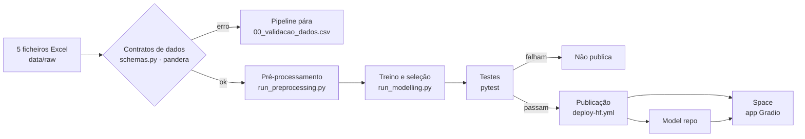

<p align="center">
  
  
  
  <a href="https://huggingface.co/spaces/tvf007/EDSBG1TP2"></a>
</p>

# Telco Customer Churn — Retention Management

Projeto D da cadeira Enterprise Data Science Bootcamp (EDSB 2026), NOVA IMS.

O sistema ajuda o *Head of Customer Retention* a decidir que clientes contactar e por que ordem. A ordem vem da perda esperada, P(churn) × CLTV, e não do risco de churn isolado.

- **App:** <https://huggingface.co/spaces/tvf007/EDSBG1TP2>
- **Modelo:** <https://huggingface.co/tvf007/EDSBG1TP2-model> (`final_model.joblib`)

## Equipa

Grupo EDSB26_G1, turma TP2.

| Nome | N.º de aluno |
|---|---|
| Francisco Monteiro | 20251694 |
| José Grave | 20251843 |
| Tiago Vacas Felgueira | 20242047 |

---

## Fluxo


```mermaid
flowchart LR
    A[5 ficheiros Excel<br/>data/raw] --> B{Contratos de dados<br/>schemas.py · pandera}
    B -- erro --> X[Pipeline pára<br/>00_validacao_dados.csv]
    B -- ok --> C[Pré-processamento<br/>run_preprocessing.py]
    C --> D[Treino e seleção<br/>run_modelling.py]
    D --> E[Testes<br/>pytest]
    E -- falham --> Y[Não publica]
    E -- passam --> F[Publicação<br/>deploy-hf.yml]
    F --> G[Model repo]
    F --> H[Space<br/>app Gradio]
    G --> H
```

| Passo | Onde | Quando corre |
|---|---|---|
| Validação dos dados | `src/telco_churn/schemas.py`, chamado em `data.load_raw` e `data.merge_datasets` | Sempre que os dados são lidos |
| Pré-processamento e modelação | `scripts/run_pipeline.py` (no deploy, com `--sem-profiling`) | Localmente e no `deploy-hf.yml` |
| Testes | `tests/` (pytest) | Em cada push ou PR (`ci.yml`) e antes de publicar |
| Publicação | `scripts/publish_hf.py` | No `deploy-hf.yml`, manual ou em push para `main`, só se a pipeline e os testes passarem |

---

## Dados

Amostra IBM *Telco Customer Churn*: 7.043 clientes na Califórnia, num único extrato do Q3 ([fonte](https://www.ibm.com/docs/en/cognos-analytics/12.0.x?topic=samples-telco-customer-churn)). O enunciado está em `reports/project_guide.pdf`.

| Ficheiro | Grão | Chave |
|---|---|---|
| `Telco_customer_churn_demographics.xlsx` | cliente | `Customer ID` |
| `Telco_customer_churn_location.xlsx` | cliente | `Customer ID` |
| `Telco_customer_churn_services.xlsx` | cliente | `Customer ID` |
| `Telco_customer_churn_status.xlsx` | cliente | `Customer ID` |
| `Telco_customer_churn_population.xlsx` | ZIP code | `Zip Code` |

- **População de modelação:** clientes `Churned` e `Stayed` (6.589). Os 454 `Joined` ficam fora do treino.
- **Target:** `churn` = 1 se *Churned*, 0 se *Stayed* (28,4%).
- **Avaliação:** holdout estratificado 80/20 ao nível do cliente, `RANDOM_STATE = 42`. A divisão é feita uma vez, no pré-processamento, e todos os modelos são avaliados nos mesmos clientes.

---

## Estrutura

```
telco-churn-retention/
├── data/
│   ├── raw/                  # 5 Excel originais (não editar)
│   └── processed/            # gerado pela pipeline (git-ignored)
├── notebooks/
│   ├── 01_preprocessing_eda.ipynb   # EDA e pré-processamento
│   ├── 01b_profiling_ydata.ipynb    # relatórios ydata-profiling
│   └── 02_modelling_eda.ipynb       # modelos, benchmark IBM, priorização e decisões de retenção
├── src/telco_churn/
│   ├── config.py             # caminhos, seed, % de teste
│   ├── style.py              # paleta e tema dos gráficos
│   ├── schemas.py            # contratos de dados (pandera)
│   ├── data.py               # carregar com validação, unir, qualidade
│   ├── features.py           # população, papéis das variáveis, feature engineering
│   ├── analysis.py           # perfis e Cramér's V
│   ├── plots.py              # gráficos da EDA
│   ├── profiling.py          # ydata-profiling com a paleta do projeto
│   ├── preprocessing.py      # split, ColumnTransformers, exportação
│   ├── modelling.py          # modelos, tuning, métricas, holdout, priorização
│   ├── retention.py          # P vs P × CLTV, custo-benefício, ações, regra de onboarding
│   ├── scoring.py            # cliente, lote, fatores e decisão de desconto
│   └── model_plots.py        # gráficos da modelação
├── scripts/
│   ├── run_pipeline.py       # ponto de entrada: pergunta que fases correr
│   ├── run_preprocessing.py  # fase 1 sem notebook
│   ├── run_profiling.py      # fase 1b
│   ├── run_modelling.py      # fase 2 sem notebook
│   └── publish_hf.py         # publica modelo e app no Hugging Face
├── tests/                    # pytest: dados, pré-processamento, modelo, app
├── app/                      # app Gradio do Space
├── MODEL_CARD.md             # publicado com o modelo
├── outputs/                  # figuras, tabelas, artefactos (git-ignored)
├── reports/                  # enunciado, status reports, dicionário de fontes
├── requirements-lock.txt     # versões exatas usadas nos resultados
└── pyproject.toml
```

Cada notebook tem um script equivalente, e os dois usam as mesmas funções de `src/telco_churn/`. Uma alteração a um modelo faz-se em `modelling.py` e vale para ambos.

---

## Como correr

### 1. Ambiente

```bash
git clone https://github.com/j3grave/Bootcamp.git
cd Bootcamp/telco-churn-retention

python -m venv .venv
# Windows:      .venv\Scripts\activate
# macOS/Linux:  source .venv/bin/activate

pip install -r requirements-lock.txt
pip install -e .          # opcional: torna telco_churn importável em qualquer pasta
nbstripout --install      # uma vez por clone: limpa os outputs dos notebooks em cada commit
```

### 2. Pipeline

```bash
python scripts/run_pipeline.py
```

Pergunta no terminal o que correr: fase 1, profiling, fase 2 (normal ou rápida), testes e publicação no Hugging Face. Publicar corre sempre os testes antes; no modo rápido só prepara os ficheiros. Com `--sem-profiling` corre as fases 1 e 2 sem perguntas, como no deploy.

Cada fase também corre sozinha, por ordem, porque cada uma usa os ficheiros da anterior:

| Fase | Notebook (kernel `.venv`, *Run All*) | Linha de comandos |
|---|---|---|
| 1. Pré-processamento e EDA | `01_preprocessing_eda.ipynb` | `python scripts/run_preprocessing.py` |
| 1b. Profiling (opcional) | `01b_profiling_ydata.ipynb` | `python scripts/run_profiling.py` |
| 2. Modelação | `02_modelling_eda.ipynb` | `python scripts/run_modelling.py` |

A fase 2 demora cerca de 1 a 2 minutos. Para testar alterações depressa: `python scripts/run_modelling.py --rapido` (sem a variante com Satisfaction Score).

### 3. Testes

```bash
pytest                          # cerca de 5 s; os do modelo precisam da fase 2
pytest tests/test_data.py -v    # só os contratos de dados
```

| Ficheiro | O que testa |
|---|---|
| `test_data.py` | Os ficheiros cumprem os contratos; derivações a 100%; merge 1:1; um valor fora do domínio (ex.: `Satisfaction Score = 9`) pára a pipeline |
| `test_preprocessing.py` | Treino e teste disjuntos e estratificados; sem leakage nas features; sem NaN depois do pré-processador |
| `test_model.py` | O modelo exportado, sem retreinar: bate a Dummy e a regra de negócio, sobreajuste < 0,05, mais bem calibrado do que a IBM nos clientes estabelecidos, corte do top 20%, separação de estabelecidos e novos no lote |
| `test_run_pipeline.py` | Ordem das fases e testes obrigatórios antes de publicar |
| `test_app.py` | Decisão do desconto nos casos limite (P = 0, P = 1, custo = 0, eficácia = 0, empate, valores inválidos) |

### 4. App local

```bash
pip install gradio==6.31.0
python app/app.py        # http://127.0.0.1:7860, com o modelo de outputs/artifacts/
```

---

## Fase 1 — Pré-processamento e EDA

| # | Etapa | O que faz |
|---|---|---|
| 1–2 | Carregamento | Lê os Excel com `keep_default_na=False`, para não perder o literal `None` |
| 3 | Validação | [Contratos de dados](#contratos-de-dados); pára se uma regra de erro falhar |
| 4 | União | Merge com `validate="one_to_one"` / `"many_to_one"`: uma linha por cliente |
| 5 | Qualidade | Missing, strings vazias, confirmação das derivações documentadas |
| 6 | População e target | Exclui `Joined`, cria o target, documenta o artefacto do tenure ≤ 3 |
| 7 | Papéis das variáveis | id, leakage, benchmark, redundante, numérica ou categórica |
| 8 | Numéricas | Skew, % de zeros, outliers IQR, distribuições por target, Spearman |
| 9 | Categóricas | Dicionário de categorias, Stayed vs Churned, Cramér's V |
| 10 | Leakage | Verificação de Satisfaction Score e Churn Score |
| 11 | Feature engineering | `n_add_on_services`, `has_refund`, `avg_hist_charge`, `charge_delta` |
| 12 | Split e pré-processadores | 80/20 estratificado; `ColumnTransformer` *linear* e *trees* |
| 13 | Exportação | CSV e `joblib` para a fase 2 |

**Gera:** `data/processed/` (`train.csv`, `test.csv`, `joined_para_scoring.csv`, `telco_merged_full.csv`), cerca de 40 gráficos em `outputs/figures/`, tabelas `01_*` a `06_*` e `outputs/artifacts/preprocessing_config.joblib`.

---

---

## Fase 2 — Modelação

| # | Etapa | O que faz |
|---|---|---|
| 3 | Modelos e métricas | Quatro modelos, três referências e as nove métricas |
| 4 | Tuning | `GridSearchCV` com grelhas pequenas e `StratifiedKFold`, só no treino |
| 5 | Comparação e escolha | Todos no mesmo 5-fold; regra de escolha; limiar do top 20% |
| 6 | Satisfaction Score | Com e sem a variável, para medir o leakage |
| 7 | Holdout | Avaliação única no teste, ao lado do Churn Score IBM; também só nos clientes estabelecidos |
| 8 | Interpretação | Permutation importance |
| 9 | Priorização | Lista por P(churn) × CLTV, custo-benefício por cenários, ações sugeridas |
| 10 | Clientes novos | Regra de onboarding para os Joined |
| 11 | Exportação | `final_model.joblib`, `prioridade_holdout.csv`, `onboarding_joined.csv` |

### Protocolo

1. **Pipelines.** Cada modelo é um `Pipeline(prep, clf)`. O pré-processador é ajustado dentro de cada fold, por isso as médias, escalas e categorias do one-hot saem só do treino desse fold.
2. **Tuning.** `GridSearchCV` com 5 folds estratificados e ROC AUC, só no treino. Decidimos usar grelhas pequenas, com 2 ou 3 valores para 1 ou 2 hiperparâmetros por modelo (`modelling.BASE_MODELS`).
3. **Comparação.** Os quatro modelos são avaliados no mesmo 5-fold, com nove métricas, ao lado de três referências que nunca são escolhidas:
   - **Dummy:** dá a todos a taxa de churn do treino;
   - **Regra de negócio** (`modelling.BusinessRuleScore`): sem ML, 1 ponto por cada fator de risco tirado da EDA (contrato Month-to-Month, tenure ≤ 12 meses, fibra ótica), de 0 a 3;
   - **Churn Score IBM:** o score / 100 nos mesmos folds.
4. **Escolha do modelo** (`modelling.select_model`). Decidimos ficar com o modelo de maior ROC AUC em CV. Se a Logistic Regression ficar a menos de 0,01 dele, escolhemos a Logistic Regression, por ser mais fácil de explicar.
5. **Holdout.** Usado uma vez, depois da escolha, em todos os clientes e só nos clientes estabelecidos. Os outros modelos aparecem só por transparência.

Usamos validação cruzada em vez de um conjunto de validação fixo porque o extrato não tem datas e, com 6.589 clientes, 20% de validação seria só cerca de 1.300. Com 5 folds, cada cliente do treino é validado uma vez, e o desvio-padrão entre folds mostra se uma diferença é real.

### Modelos

| Modelo | Como funciona | Hiperparâmetros afinados | Pré-processador |
|---|---|---|---|
| Baseline (Dummy) | Dá a todos a taxa de churn do treino | — | trees |
| Regra de negócio | 1 ponto por fator de risco, de 0 a 3 | — | — |
| Logistic Regression | Soma ponderada das variáveis passada por uma sigmoide | `C` | linear |
| Decision Tree | Perguntas sucessivas sobre uma variável de cada vez | `max_depth`, `min_samples_leaf` | trees |
| Random Forest | 300 árvores em amostras bootstrap, média das probabilidades (bagging) | `min_samples_leaf`, `max_features` | trees |
| Gradient Boosting | Árvores pequenas em sequência, cada uma corrige as anteriores (`HistGradientBoostingClassifier`) | `learning_rate`, `max_leaf_nodes` | trees |
| Churn Score IBM | Score 0–100 do modelo que a empresa já usa | — | benchmark, nunca é feature |

O pré-processador `linear` faz imputação, `StandardScaler` e one-hot; o `trees` faz imputação e one-hot, sem escala, porque as árvores comparam cada variável consigo própria.

### Métricas

As quatro primeiras usam as probabilidades; as outras cinco usam o limiar 0,5.

| Métrica | O que mede | Leitura neste projeto |
|---|---|---|
| ROC AUC | Probabilidade de um churner ter score mais alto do que um não-churner | **Métrica de seleção.** 0,5 = acaso |
| PR AUC | Área sob a curva precision-recall | Foca os churners; a base é 0,28 |
| Brier | Erro quadrático entre probabilidade e resultado | **Calibração**, precisa para P × CLTV |
| Log loss | Penaliza probabilidades confiantes e erradas | Também calibração |
| Accuracy | % bem classificados | Enganadora: o Dummy tem ~72% |
| Balanced accuracy | Média do recall nas duas classes | 0,5 = acaso |
| Precision | % dos sinalizados que saíram | Contactos bem gastos |
| Recall | % dos churners sinalizados | Cobertura |
| F1 | Média harmónica de precision e recall | Equilíbrio no limiar 0,5 |

Decidimos escolher por ROC AUC porque a equipa de retenção trabalha com uma lista ordenada e contacta os primeiros N que o orçamento permite: o que conta é a ordenação.

**Capacidade da equipa.** Além do limiar 0,5, usamos o P(churn) que sinaliza o top 20% dos clientes estabelecidos (`modelling.capacity_threshold`). É fixado nas previsões out-of-fold do treino e aplicado uma vez ao holdout e depois à app. Quantos clientes contactar sai do custo-benefício, não de uma métrica.

### Resultados

Holdout de 1.318 clientes (`13_holdout.csv` e `13d_holdout_estabelecidos.csv`). O modelo escolhido é o **Gradient Boosting** (AUC em CV 0,938 ± 0,004; a Logistic Regression fica a 0,024).

| Clientes do holdout | Score | ROC AUC | PR AUC | Brier |
|---|---|---|---|---|
| Todos (1.318) | Gradient Boosting | 0,935 | 0,881 | 0,087 |
| | Churn Score IBM | 0,941 | 0,876 | 0,214 |
| | Regra de negócio | 0,841 | 0,622 | 0,135 |
| Estabelecidos, tenure > 3 (1.183) | Gradient Boosting | 0,898 | 0,724 | 0,097 |
| | Churn Score IBM | 0,939 | 0,831 | 0,234 |

O Churn Score IBM ordena melhor, sobretudo nos clientes estabelecidos. Decidimos usar o nosso modelo na priorização na mesma, por três razões:

1. dá probabilidades calibradas, de que P × CLTV e a decisão de desconto precisam (Brier 0,097 contra 0,234; o Churn Score / 100 não é uma probabilidade);
2. usa só variáveis conhecidas antes do churn, enquanto não sabemos com que informação o Churn Score foi calculado;
3. bate a Dummy e a regra de negócio, sem sobreajuste (AUC treino − CV = 0,037).

A calibração confirma-se nos clientes estabelecidos do holdout (`13e_calibracao_estabelecidos.csv`):

| Faixa de P(churn) | % dos estabelecidos | P média | Churn real |
|---|---|---|---|
| < 30% | 74% | 7% | 8% |
| 30–60% | 14% | 44% | 39% |
| ≥ 60% | 12% | 77% | 76% |

Com o Satisfaction Score, o AUC sobe para 0,996: é o sinal de leakage que nos levou a deixá-lo de fora.

### Clientes novos

Os Joined têm todos 1 a 3 meses de casa. Um cliente novo que fica é rotulado Joined e sai da população; um que sai é rotulado Churned e fica. Resultado: dentro de Churned + Stayed, os 597 clientes com tenure ≤ 3 saíram todos (`02b_tenure_estado.csv`). Não é comportamento, é a forma como os estados foram registados.

O modelo aprende por isso que "cliente recente = churn" e dá a estes clientes P ≈ 1. Decidimos:

- treinar um só modelo com a população do enunciado (todos os tenures);
- usar a P(churn) só nos clientes estabelecidos (tenure > 3), onde o modelo continua calibrado;
- tratar os clientes novos com uma regra de onboarding (`retention.onboarding_segment`): contrato Month-to-Month com fibra = onboarding prioritário; restantes Month-to-Month = onboarding standard; contratos de 1 ou 2 anos = sem ação específica.

### Decisões de retenção

- **P × CLTV vs só P.** `15b_P_vs_PxCLTV.csv` compara as duas listas: clientes em comum, churners e CLTV cobertos. A comparação com a IBM é sempre entre ordenações do mesmo tipo.
- **Quantos contactar.** Depende de dois pressupostos que o dataset não tem, a taxa de sucesso e o custo por contacto. Estão em `retention.CENARIOS`, em três cenários. Decidimos contactar quando P × CLTV × taxa de sucesso > custo.
- **Ações por segmento** (`suggest_action`) e **regra de onboarding** são hipóteses. A importância das variáveis mostra o que o modelo usa, não o efeito de as mudar. Cada ação deve ser testada com um grupo de controlo sorteado (por exemplo, 20% de cada segmento sem contacto).

### Limitações

- **Brier e log loss da IBM** são indicativos: o score / 100 não é uma probabilidade. A comparação justa é por ROC AUC, PR AUC e curva de captura.
- **Validação cruzada não aninhada.** O tuning e a comparação usam os mesmos folds, por isso o AUC em CV do vencedor é ligeiramente otimista. A confirmação final é no holdout, que não entrou no tuning.
- **Uso do holdout.** Não serve para escolher modelos nem hiperparâmetros. É usado depois disso para as métricas finais, a variante com Satisfaction Score, a importância das variáveis, a curva de captura e o valor líquido dos cenários.
- **Variáveis geográficas.** `Latitude`, `Longitude` e `Population` entram (AUC univariada 0,52–0,54). `City`, `Zip Code`, `Lat Long`, `Country` e `State` saem.
- **Dados sintéticos e sem datas.** Os padrões podem não se transferir para dados reais e não há validação temporal.

### Outputs da fase 2

| Tabelas (`outputs/tables/`) | Conteúdo |
|---|---|
| `10_tuning_modelos` | AUC em CV e melhores hiperparâmetros |
| `11_cv_modelos` | Nove métricas por modelo, CV e treino |
| `11b_limiares_modelo_final` | Precision, recall, F1 por limiar |
| `11d_selecao_modelo` | Modelo escolhido e justificação |
| `11e_limiares_cv`, `13b_limiares_holdout_estabelecidos` | Limiar 0,5 e top 20% dos estabelecidos |
| `12_variante_satisfaction` | Efeito do Satisfaction Score |
| `13_holdout`, `13d_holdout_estabelecidos` | Nove métricas no holdout, com as referências |
| `13c_calibracao_holdout`, `13e_calibracao_estabelecidos` | P média e churn real por faixa de P |
| `14_importancia_permutacao` | Queda de AUC por variável |
| `15_captura_valor`, `15b_P_vs_PxCLTV` | Captura de valor; P vs P × CLTV |
| `19_regra_onboarding` | Segmentos de onboarding e taxa de saída |
| `20_cenarios_custo_beneficio` | N a contactar por cenário |
| `21_acoes_sugeridas` | Top-N do cenário Base por ação |

| Gráficos (`outputs/figures/`) | O que mostra |
|---|---|
| `21_cv_modelos` | ROC AUC em CV com as referências |
| `22_painel_metricas_cv` | Nove métricas por modelo em CV |
| `23_sobreajuste` | AUC treino vs CV |
| `23b_roc_pr_cv`, `23c_matrizes_confusao_cv` | Curvas e matrizes de confusão out-of-fold |
| `23d_limiar_modelo_final` | Métricas por limiar, com o corte do top 20% |
| `24_roc_calibracao`, `24b_painel_metricas_holdout` | ROC, calibração e métricas no holdout |
| `25_captura_valor`, `26_mapa_prioridade` | Captura de CLTV e mapa P × CLTV |
| `27_importancia_permutacao` | Importância das variáveis |
| `30_valor_liquido` | Valor líquido por nº de contactos e cenário |

Também gera `outputs/artifacts/final_model.joblib` e, em `data/processed/`, `prioridade_holdout.csv` e `onboarding_joined.csv`.

---

## Decisões principais

| Decidimos | Porquê |
|---|---|
| Excluir `Customer Status` e `Churn Label/Value/Category/Reason` | Codificam o resultado ou só existem depois do churn |
| Usar o `Churn Score` como benchmark, não como feature | É a saída do modelo IBM existente |
| Deixar o `CLTV` fora das features | É usado na priorização, P(churn) × CLTV |
| Deixar o `Satisfaction Score` fora | Scores 1–2 dão 100% de churn; com ele o AUC sobe para 0,996, sinal de leakage |
| Remover `Under 30`, `Senior Citizen`, `Dependents`, `Referred a Friend`, `Total Revenue` | Derivações exatas de outras colunas (verificadas a 100%) |
| Comparar só quatro modelos, com grelhas de tuning pequenas | Cobrem as famílias principais (linear, árvore, bagging, boosting); em versões anteriores, ensembles mais complexos não ganharam ao Gradient Boosting |
| Usar um só modelo e a P(churn) só nos clientes com tenure > 3 | Nos clientes estabelecidos, um modelo treinado só com eles deu o mesmo AUC e o mesmo Brier |
| Não usar PCA | As árvores não precisam e a interpretabilidade conta na retenção |
| Tratar a taxa de sucesso e o custo por contacto como pressupostos | Não existem nos dados; três cenários |
| Contratos de dados com duas severidades | Erro pára a pipeline; aviso regista e continua |
| Publicar o modelo num Model repo separado do Space | O Space descarrega-o com `hf_hub_download`; o pacote `telco_churn` é copiado no deploy |

---

## Contratos de dados

As regras estão em `src/telco_churn/schemas.py` e o resultado de cada uma em `outputs/tables/00_validacao_dados.csv`. Uma regra de **erro** pára a pipeline com `DataValidationError`; um **aviso** fica registado e a pipeline continua. Todas as regras de erro passam a 100% nos dados atuais.

| Camada | Tipo | Regras | Severidade |
|---|---|---|---|
| 5 ficheiros | Esquema | Colunas esperadas e tipos | erro |
| demographics, location, services, status | Chaves | `Customer ID` único e igual nos 4 ficheiros | erro |
| population / location | Chaves | `Zip Code` único em population e presente para todos os de location | erro |
| status | Domínios | `Satisfaction Score` ∈ {1..5}; `Churn Score` ∈ [0, 100]; `CLTV` > 0; estados, labels e categorias conhecidos | erro |
| services | Domínios | Contrato, oferta, internet e pagamento nas categorias conhecidas; `Tenure` ∈ [1, 120]; `Monthly Charge` ∈ [0, 300]; `Total Charges` ∈ [0, 50 000]; valores ≥ 0 | erro |
| demographics, location, population | Domínios | `Age` ∈ [18, 100]; dependentes ∈ [0, 15]; Califórnia, EUA; `Population` > 0 | erro |
| base unida | Regras de negócio | `Churn Label = Yes` ⇔ `Churned`; razão e categoria só nos Churned; sem internet ⇒ sem add-ons; sem telefone ⇒ sem linhas múltiplas | erro |
| base unida | Derivações | `Under 30`, `Senior Citizen`, `Dependents`, `Referred a Friend` e `Total Revenue` coerentes com a origem | erro |
| base unida | Estatísticas | ≈ 7.043 clientes (± 5%); churn ≈ 28,4% (± 3 p.p.); ≤ 5% de missing; Joined ⇒ tenure ≤ 3 | aviso |
| pré-processamento | Saída | Treino e teste sem IDs comuns; churn semelhante (± 1 p.p.); sem colunas de leakage; zero NaN | erro |

Os intervalos são plausíveis, não os mínimos e máximos observados (idades observadas 19–80, contrato aceita 18–100). Para ver uma regra a falhar: mudar um `Satisfaction Score` para 9 no Excel de status e correr `python scripts/run_preprocessing.py`.

---

## Identidade visual

| Cor | HEX | Uso |
|---|---|---|
| Azul Digital | `#3777FF` | Destaque principal, *Stayed*, títulos |
| Verde Néon | `#0EE071` | Acento, *Churned*, realces |
| Preto Profundo | `#000000` | Fundo |

A paleta está em `src/telco_churn/style.py`. As secções dos notebooks usam HTML com estilos *inline*, visíveis no VS Code e no Jupyter; o GitHub remove-os na pré-visualização, mas o texto continua legível.

---

## Git

```bash
git checkout -b feature/<nome-curto>
git add .
git commit -m "EDA: adiciona análise de contratos"
git push -u origin feature/<nome-curto>
# Pull Request -> revisão -> merge para main
```

- Não fazer commit de dados processados nem de outputs: regeneram-se localmente.
- Não editar `data/raw/`.
- Funções novas vão para `src/telco_churn/`; os notebooks servem para explorar e narrar.
